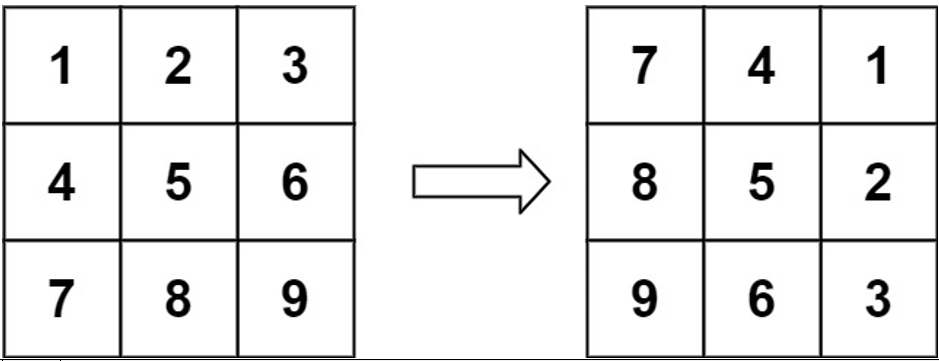
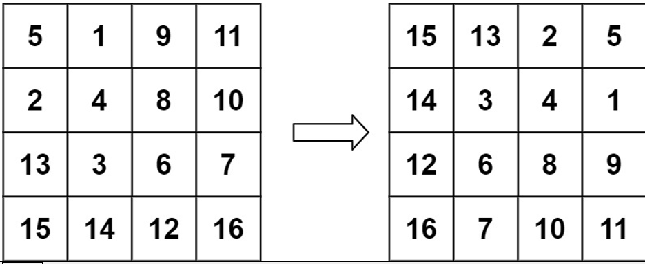

Curriculum Structure:

Week 1 : Introduction to Programming:
Assignments 1.1

    1. Create a console application in C# to store and print personal details of a person like name, age and address on console screen. Make use of appropriate variables.
    2. Write a C# program to print the sum of two numbers. Get the input from user.
    3. Write a C# program to print the result of dividing two numbers. Print the quotient and remainder as well. Get the input from the user.

Assignments 1.2

    Write a C# Sharp program to accept two integers and check whether they are equal or not.
    Test Data :
    Input 1st number: 5
    Input 2nd number: 5
    Expected Output :
    5 and 5 are equal
    Test Data :
    Input 1st number: 5
    Input 2nd number: 15
    Expected Output :
    5 and 15 are not equal
    Write a C# Sharp program to find the sum of first 10 natural numbers.
    Expected Output :
    The first 10 natural number is :
    1 2 3 4 5 6 7 8 9 10
    The Sum is : 55
    Write a menu driven application to perform calculation functions like addition, subtraction, multiplication, and division. Call them appropriately when user selects the option. Give the user the option to continue or exit the program.

Assignment 1.3

    Write a program in C# to calculate area of triangle, square and rectangle. Write 3 different functions for each shape to take dimensions of figure and display the area. You may create menus.
    Write a console application in C# to explore different ways in which array is declared and initialized and explore different properties and methods of Array class.
    Write a program in C# to read n number of values in an array and display it in reverse order.
    Test Data :
    Input the number of elements to store in the array :3
    Input 3 number of elements in the array :
    element - 0 : 2
    element - 1 : 5
    element - 2 : 7
    Expected Output:
    The values store into the array are:
    2 5 7
    The values store into the array in reverse are :
    7 5 2

Assignments 1.4

    Create a structure named “Point” and 2 data members: X and Y coordinate. Declare 2 points: P1 and P2. Determine if P2 is to the right or left of P1 or on same axis , by comparing the x xoordinates. ( if p1.x is more than p2.x , it is to the right )
    Write a class: “Student” with private data members: StudentId ( int), StudentFname (string), StudentLname (string ), StudentGrade ( char ) and public properties for each data member. Instantiate the class and assign data to properties. Display the data back on console.

Week 2 : Introduction to Programming:

Assignments 2.2

    1. Design a class hierarchy of your choice. (Need only class files )
    2. Overloading: Write a simple Maths class ( don’t use the keyword Math, it will be a conflict with standard class from system). Write overloaded methods with logic and give choice to user to call different methods :
    a. Add(int num1, int num2)
    b. Add(decimal num1, decimal num2, decimal num3)
    c. Multiply(float num1, float num2)
    d. Multiply( float num1, float num2, float num3)
    Declare these methods as public and static.

    3. Write a abstract base class: ‘Shape’ and add properties like id, name and color and method ‘calculate area’ .
    Inherit circle shape from base class and add properties like radius. override calculate area logic for circle.
    Inherit square class from shape and change the calculate area logic. Add property like side of square.
    Take the input from user to select circle or square and display the calculated area . no hard coded values!

Assignments 2.3

    1. Write a console application to create a text file and save your basic details like name, age, address ( use dummy data). Read the details from same file and print on console.

    2. Design a tip calculator : enter the bill total, tip % and display grand total after adding tip.
    Use the format specifiers to display currency, % symbol.

Assignments 2.4

    1. Write a program in C# Sharp to find the sum of all array elements.
    Test Data :
    Input the number of elements to be stored in the array :3

    Input 3 elements in the array :
    element - 0 : 2
    element - 1 : 5
    element - 2 : 8

    Expected Output :
    Sum of all elements stored in the array is : 15

    2. Write a C# Sharp program to find the largest of three numbers.
    Test Data :
    Input the 1st number :25
    Input the 2nd number :63
    Input the 3rd number :10

    Expected Output :
    The 2nd Number is the greatest among three

    3. Write a C# Sharp program to accept a coordinate point in an XY coordinate system and determine in which quadrant the coordinate point lies.
    Test Data :
    Input the value for X coordinate :7
    Input the value for Y coordinate :9
    Expected Output :
    The coordinate point (7,9) lies in the First quadrant.

Week 2 Challenge Labs

    Write a C# Sharp program to read temperature in Fahrenheit and display a suitable message according to temperature state below :
    Temp 0< 10 then Freezing weather
    Temp 11-20 then Very Cold weather
    Temp 21-35 then Cold weather
    Temp 36-50 then Normal in Weather
    Temp 51-65 then Its Hot
    Temp 66-80 then Its Very Hot
    Test Data :
    67
    Expected Output :
    Its very hot.

    2. Write a C# Sharp program that takes userid and password as input (type string). After 3 wrong attempts, user will be rejected.

    3. Write a C# Sharp program that takes a number and a width also a number, as input and then displays a triangle of that width, using that number.
    Test Data
    Enter a number: 6
    Enter the desired width: 6
    Expected Output:

    666666
    66666
    6666
    666
    66
    6

    4. Write a C# Sharp program to read roll no, name and marks of three subjects and calculate the total, percentage and division. (May use a struct / class to represent the student)
    Test Data :
    Input the Roll Number of the student :784
    Input the Name of the Student :James
    Input the marks of Physics, Chemistry and Computer Application : 70 80 90
    Expected Output :
    Roll No : 784
    Name of Student : James
    Marks in Physics : 70
    Marks in Chemistry : 80
    Marks in Computer Application : 90
    Total Marks = 240
    Percentage = 80.00
    Division = First

Week 3 : Programming in C#:
Assignments 3.1

    1. Return even numbers
    Write a method that returns a string of even numbers greater than 0 and less than 100.
    (Use StringBuilder class)
    Expected input and output
    ReturnEvenNumbers() → "2 4 6 8 10 12 14 16 18 20 22 24 26 28 30 32 34 36 38 40 42 44 46 48 50 52 54 56 58 60 62 64 66 68 70 72 74 76 78 80 82 84 86 88 90 92 94 96 98"

    2. If year is leap
    Given a year as integer, write a method that checks if year is leap.

    Expected input and output
    IfYearIsLeap(2016) → true IfYearIsLeap(2018) → false

    3. Write a program in C# Sharp to create a function to input a string and count number of spaces are in the string.
    Test Data :
    Please input a string : This is a test string.
    Expected Output :
    "This is a test string." contains 4 spaces

    4. Write a function which takes an array as input and finds the first occurrence of 2 consecutive 1s and changes their value to 0.
    For e.g: Input : [0,2,1,1,9,1,1]
    Output: [0,2,0,0,9,1,1]

Assignments 3.2

    1. Create a 2D array to store integers and print them in matrix format with proper formatting.
    e. g:
    | 2 | 3 | 4 |
    | 1 | 4 | 6 |

    2. Write a program in C# Sharp for addition of two Matrices of same size.
    Test Data :
    Input the size of the square matrix (less than 5): 2
    Input elements in the first matrix :
    element - [0],[0] : 1
    element - [0],[1] : 2
    element - [1],[0] : 3
    element - [1],[1] : 4

    Input elements in the second matrix :
    element - [0],[0] : 5
    element - [0],[1] : 6
    element - [1],[0] : 7
    element - [1],[1] : 8

    Expected Output:

    The First matrix is:
    1 2
    3 4

    The Second matrix is :
    5 6
    7 8

    The Addition of two matrix is :
    6 8
    10 12

    3. Create a console application to overload “+” and “-“ operator for adding the areas of 2 circles and getting their area difference respectively.

    4. Write a function that takes 4 numbers as input to calculate the total and average.
    (Make use of params array to pass arguments and out parameters to return both total and average to main method).
    Test Data:
    Enter the First number: 10
    Enter the Second number: 15
    Enter the third number: 20
    Enter the fourth number: 30

    Expected Output:
    The average of 10 , 15 , 20 , 30 is: 18.75
    The total is 75

    5. Create a function that finds the index of a given item in the array
    Examples
    Search([1, 5, 3], 5) ➞ 1
    Search([9, 8, 3], 3) ➞ 2
    Search([1, 2, 3], 4) ➞ -1

    Notes
    If the item is not present, return -1.

Assignments 3.3

    Windows form assignments

    1. Use different controls on windows forms and change their properties (do not submit this assignment)
    2. Create a class: Student with fields like studid, firstname, lastname, address,monthofadmission,grade to hold character.

    Create a list of students and perform following operations in windows application:

    1. add new records,
    2. delete record and
    3. display them in grid.

    Monthofadmission should be enum.

Assignments 3.4

    1. Create an abstract base class to represent “Beverage” and inherit “Coffee” class from it. Create a list ( you may use List class) of coffees. Design windows form application to display the list of coffees in grid and perform add/ delete.  Keep some base properties in Beverage class which can be inherited in Coffee. Inherited class can have more specific properties. Properties are customizable as needed.

Week 3 Challenge Labs

    1. Given a string, write a method that checks if it is a palindrome (is read the same backward as forward). Assume that string may consist only of lower-case letters.

    Expected input and output
    IsPalindrome("eye") → true
    IsPalindrome("home") → false

    2. Sum digits in string
    Given a string, write a method which returns sum of all digits in that string. Assume that string contains only single digits.

    Expected input and output
    SumDigitsInString("1q2w3e") → 6 SumDigitsInString("L0r3m.1p5um") → 9
    SumDigitsInString("") → 0

    3. Given an array of integers nums and an integer target, return indices of the two numbers such that they add up to target.
    You may assume that each input would have exactly one solution, and you may not use the same element twice.
    Input: nums = [2,7,11,15], target = 9
    Output: [0,1]
    Explanation: Because nums[0] + nums[1] == 9, we return [0, 1].

    4. You are given a string s consisting only of uppercase English letters.
    You can apply some operations to this string where, in one operation, you can remove any occurrence of one of the substrings "AB" or "CD" from s.
    Return the minimum possible length of the resulting string that you can obtain.
    Note that the string concatenates after removing the substring and could produce new "AB" or "CD" substrings.

    **Hint : Use Replace method of string.

    Example 1:
    Input: s = "ABFCACDB"

    Output: 2
    Explanation: We can do the following operations:
    - Remove the substring "ABFCACDB", so s = "FCACDB".
    - Remove the substring "FCACDB", so s = "FCAB".
    - Remove the substring "FCAB", so s = "FC".
    So the resulting length of the string is 2.
    It can be shown that it is the minimum length that we can obtain.

    Example 2:
    Input: s = "ACBBD"
    Output: 5
    Explanation: We cannot do any operations on the string so the length remains the same.

Week 4 : Programming in C#:

Assignments 4.1

    1. Design a personal phone /address book using Dictionary collection. Write a person class to store details of person like : FirstName , LastName , Mobile Phone , Work Phone and Address.

    Provide a grid to display all, add more, delete ( with confirmation message) and search by name.
    Search should show details of person searched. You may use the key as name of person.

    2. Create an interface for ICalculator for methods like add, subtract, divide, multiply and implement them in a class: Math.
    Use winforms to design a simple calculator with textboxes and buttons . Use the above designed interface in the calculator.

Assignments 4.2

    Design a mini learning management for Teacher Role. Allow the Teacher to login. If the User id is “Teacher” and password “Admin” allow the user to get into the system and open another form. Allow teacher to add student with following fields:

    Student Id
    Student name
    GPA

    Use any suitable generic list to save students in it.
    Save the details of the student with highest GPA in a text file.
    Allow teacher to delete the student.

    * Write class for Student and include necessary properties in them.
    **If you want more properties in Student add them as needed.

Assignments 4.3

    Write a program in C# Sharp to calculate and print the Electricity bill of a given customer. The customer id., name and unit consumed by the user should be taken from the keyboard and display the total amount to pay to the customer. The charge are as follows: (you may change the charge sheet values)

    | Unit | Charge/unit |
    |------|-------------|
    | upto 199 | @1.20 |
    |200 < > 400 | @1.50 |
    | 400 < > 600 | @1.80 |
    |600 < | @2.00 |

    If bill exceeds $ 400 then a surcharge of 15% will be charged.

    Test Data :
    1001
    James
    800
    Expected Output :
    Customer IDNO :1001
    Customer Name :James
    unit Consumed :800
    Amount Charges @$ 2.00 per unit : 1600.00
    Surcharge Amount : 240.00
    Net Amount Paid By the Customer : 1840.00

  
    2. Write a program in C# Sharp to count the frequency of each element of an array.
    Test Data :
    Input the number of elements to be stored in the array :3
    Input 3 elements in the array :
    element - 0 : 25
    element - 1 : 12
    element - 2 : 43
    Expected Output :
    Frequency of all elements of array :
    25 occurs 1 times
    12 occurs 1 times
    43 occurs 1 times

    3. Write a program in C# Sharp to print all unique elements in an array.
    Test Data :
    Input the number of elements to be stored in the array :3
    Input 3 elements in the array :
    element - 0 : 1
    element - 1 : 5
    element - 2 : 1
    Expected Output :
    The unique elements found in the array are :
    5

Week 4 Challenge Labs

    1. If number contains 3
    Write a method that checks if given number (positive integer) contains digit 3. Do not convert number to other type. Do not use built-in functions like Contains(), StartsWith(), etc.

    Expected input and output
    IfNumberContains3(7201432) → true IfNumberContains3(87501) → false

    2. Divisible by 2 or 3
    Given two integers, write a method that returns their multiplication if they are both divisible by 2 or 3, otherwise returns their sum.

    Expected input and output
    DivisibleBy2Or3(15, 30) → 450 DivisibleBy2Or3(2, 90) → 180 DivisibleBy2Or3(7, 12) → 19

    3. Write a function that reverses a string. The input string is given as an array of characters s.
    You must do this by modifying the input array in-place. (Problem 344 in leetcode)

    Example 1:
    Input: s = ["h","e","l","l","o"]
    Output: ["o","l","l","e","h"]

    Example 2:
    Input: s = ["H","a","n","n","a","h"]
    Output: ["h","a","n","n","a","H"]

Week 5 - Data Structures & Algorithms:

Assignment 5.1

    1. Given an integer x, return true if x is a palindrome, and false otherwise.

    Example 1:
    Input: x = 121
    Output: true
    Explanation: 121 reads as 121 from left to right and from right to left.

    Example 2:
    Input: x = -121
    Output: false
    Explanation: From left to right, it reads -121. From right to left, it becomes 121-. Therefore it is not a palindrome.

    2. Write a program in C# Sharp to create a function to calculate the sum of the individual digits of a given number.
    Test Data :
    Enter a number: 1234
    Expected Output :
    The sum of the digits of the number 1234 is : 10

    3. Given an integer array nums, return true if any value appears at least twice in the array, and return false if every element is distinct.
    Example 1:
    Input: nums = [1,2,3,1]
    Output: true

    Example 2:
    Input: nums = [1,2,3,4]
    Output: false

    Example 3:
    Input: nums = [1,1,1,3,3,4,3,2,4,2]
    Output: true

Assignment 5.2

    1. Given a string s consisting of words and spaces, return the length of the last word in the string. A word is a maximal substring consisting of non-space characters only.

    Example 1:
    Input: s = "Hello World"
    Output: 5
    Explanation: The last word is "World" with length 5.

    Example 2:
    Input: s = " fly me to the moon "
    Output: 4
    Explanation: The last word is "moon" with length 4.

    2. Write a program in C# Sharp to print the first n natural number using recursion.
    Test Data :
    How many numbers to print : 10
    Expected Output :
    1 2 3 4 5 6 7 8 9 10

    3. Write a program in C# Sharp to print numbers from n to 1 using recursion.
    Test Data :
    How many numbers to print : 10
    Expected Output :
    10 9 8 7 6 5 4 3 2 1

    4. Write a program in C# Sharp to check whether a given string is Palindrome or not using recursion.
    Test Data :
    Input a string : RADAR
    Expected Output :
    The string is Palindrome.

Assignments 5.3

    1. You have a long flowerbed in which some of the plots are planted, and some are not. However, flowers cannot be planted in adjacent plots. Given an integer array flowerbed containing 0's and 1's, where 0 means empty and 1 means not empty, and an integer n, return true if n new flowers can be planted in the flowerbed without violating the no-adjacent-flowers rule and false otherwise.

    Example 1:
    Input: flowerbed = [1,0,0,0,1], n = 1
    Output: true

    Example 2:
    Input: flowerbed = [1,0,0,0,1], n = 2
    Output: false

    2. You are climbing a staircase. It takes n steps to reach the top. Each time you can either climb 1 or 2 steps. In how many distinct ways can you climb to the top?

    Example 1:
    Input: n = 2
    Output: 2
    Explanation: There are two ways to climb to the top.
    1. 1 step + 1 step
    2. 2 steps

    Example 2:
    Input: n = 3
    Output: 3
    Explanation: There are three ways to climb to the top.
    1. 1 step + 1 step + 1 step
    2. 1 step + 2 steps
    3. 2 steps + 1 step

Assignments 5.4

    1. Write a program in C# Sharp to display the individual digits of a given number using recursion.
    Test Data :
    Input any number : 1234
    Expected Output :
    The digits in the number 1234 are : 1 2 3 4

    2. Write a C# Sharp program to find the sum of the right diagonals of a matrix.
    Test Data :
    Input the size of the square matrix : 2
    Input elements in the first matrix :
    element - [0],[0] : 1
    element - [0],[1] : 2
    element - [1],[0] : 3
    element - [1],[1] : 4
    Expected Output :
    The matrix is :
    1 2
    3 4
    Addition of the right Diagonal elements is :5

Week 5 Challenge Labs

    Given a non-empty array of integers nums, every element appears twice except for one. Find that single one.

    Example 1:
    Input: nums = [2,2,1]
    Output: 1

    Example 2:
    Input: nums = [4,1,2,1,2]
    Output: 4

    Example 3:
    Input: nums = [1]
    Output: 1

    2. Given an array nums containing n distinct numbers in the range [0, n], return the only number in the range that is missing from the array.
    Example 1:
    Input: nums = [3,0,1]
    Output: 2
    Explanation: n = 3 since there are 3 numbers, so all numbers are in the ran  ge [0,3]. 2 is the missing number in the range since it does not appear in nums.

    Example 2:
    Input: nums = [0,1]
    Output: 2
    Explanation: n = 2 since there are 2 numbers, so all numbers are in the range [0,2]. 2 is the missing number in the range since it does not appear in nums.

    Example 3:
    Input: nums = [9,6,4,2,3,5,7,0,1]
    Output: 8
    Explanation: n = 9 since there are 9 numbers, so all numbers are in the range [0,9]. 8 is the missing number in the range since it does not appear in nums.

Week 6 - Data Structures & Algorithms:
Assignments 6.1

    1. Implement a single linked list with each node representing a house. You may add data in it like house number, brief address, type of house ( like Ranch, Colonial) . each house (node) will be linked to next .Give facility to the user to search a house by its number and then display the details. ( Windows / Console)

    2. Explore Linkedlist class from C# library.

    3. Given an integer array nums, move all 0's to the end of it while maintaining the relative order of the non-zero elements.

    Note that you must do this in-place without making a copy of the array.

    Example 1:

    Input: nums = [0,1,0,3,12]
    Output: [1,3,12,0,0]
    Example 2:

    Input: nums = [0]
    Output: [0]

Assignments 6.2

    1. Write a C# program to implement a stack by using array with push and pop operations.
    2. Given an integer array nums, return an array answer such that answer[i] is equal to the product of all the elements of nums except nums[i].
    The product of any prefix or suffix of nums is guaranteed to fit in a 32-bit integer.
    You must write an algorithm that runs in O(n) time and without using the division operation.

    Example 1:
    Input: nums = [1,2,3,4]
    Output: [24,12,8,6]

    Example 2:
    Input: nums = [-1,1,0,-3,3]
    Output: [0,0,9,0,0]

Assignments 6.3

    You are developing a program to manage a call queue of customers using the Queue  in C#. The program creates a queue of callers and demonstrates the functionality of enqueueing elements into the queue and iterating over the elements and dequeuing.

    Use linked lists.

Week 6 Challenge Labs

    You are given an n x n 2D matrix representing an image, rotate the image by 90 degrees (clockwise). You have to rotate the image in-place, which means you have to modify the input 2D matrix directly. DO NOT allocate another 2D matrix and do the rotation.

    Example 1:
    Input: matrix = [[1,2,3],[4,5,6],[7,8,9]]
    Output: [[7,4,1],[8,5,2],[9,6,3]]

    Example 2:
    Input: matrix = [[5,1,9,11],[2,4,8,10],[1You are given an n x n 2D matrix representing an image, rotate the image by 90 degrees (clockwise).

    You have to rotate the image in-place, which means you have to modify the input 2D matrix directly. DO NOT allocate another 2D matrix and do the rotation.

    Example 1:
    Input: matrix = [[1,2,3],[4,5,6],[7,8,9]]
    Output: [[7,4,1],[8,5,2],[9,6,3]]

    Example 2:
    Input: matrix = [[5,1,9,11],[2,4,8,10],[13,3,6,7],[15,14,12,16]]
    Output: [[15,13,2,5],[14,3,4,1],[12,6,8,9],[16,7,10,11]]3,3,6,7],[15,14,12,16]]
    Output: [[15,13,2,5],[14,3,4,1],[12,6,8,9],[16,7,10,11]]
