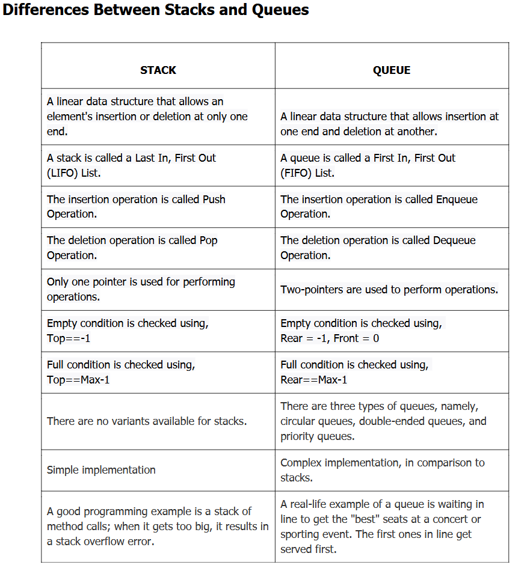

# Types of Class Design

- Abstraction: create a template for something; abstract an idea / real life
- Encapsulation: private / public; group the attributes + behavior 
  - think of it like a container (literally a capsule) and only public things can 
	be exposed
- Inheritance: Person --> Employee --> Parttime Employee (making the thing more and 
more specific; from BASE Class to DERIVED class) 
- Polymorphism: 
  - beverage --> Coffee
  - setBaseTemp --> override setBaseTemp for DERIVED Class
	- virtual -> override
	- abstract method --> must override

```
namespace Mod1Demo1
{
	internal class Program
	{	
		static void Main (string[] args)
		{
			FileStream obj=new Filestream()
		}
		// static polymorphism (overloading)
		static int Add (int num1, num2)
		{
			return numb1 + num2;
		}
```

# Object

- Must have certain attributes or features
  - color or shape
- Inherits certain features from its class
  - class is a blueprint or template used to create objects
- Is created dynamically as an instance of a class
  - more than one object can be created using a class

| Class | Object |
| car | toyota , Subaru |

# Data Immutability


# Creation of Parameterized Constructors

# Modifying Immutable Data Objects
- Immutable data types cannot 


# C Sharp is an Imperative Programming language
- tells the machine "how to do it"
- Employs statements to modify the state of the program
- Divides 

| Declarative Programming | Imperative Programming |
| focus on the problem | focus on how to solve the problem |
| Works on logic of computation | Follows a step-by-step procedure to describe the control flow of computation |
| Describes the result | Describes the process of accomplishing a task |
| To add repetition, add scripts | Full control to devs.  Users make decisions |
| Sub-types include logic programming and functional programming | Sub-types include procedural programming, object-oriented programming, and parallel processing approach |
| Examples: HTML, SQL, etc | Examples - C#, C, etc. |

# Method
- create a method
  - defined by the methods name followed by the prenthesis ()
  - start each word in the methods name with an uppercase letter (referred to as PascalCase)
- Call a method
  - means executing the method
  - Requires writing the method's name followed by () in which you can pass in specific args
  - can invoke static methods by using ClassName.MethodName();
  - Can invoke instance methods by using "objname.MethodName();"
- Call Method multiple times
  - can be called more than once

# Loops
- Initialize --> Condition --> True --> Statment(s) --> Increment --> Condition --> False (exit)

- While Loop: Do while true
  - initialization happens within the loop

- For Loop: for each condition do the loop

- Do-while Loop
  - executes code block loop then checks the condition


# Jump Statements
- Break
  - terminates a loop or switch statement prematurely
  - does not have a condition evaluated to determine when to terminate the loop or switch statement


# Whiteboarding

## Example 5.1.1 - Palindrome Integer:

psuedo code : english like statements + syntax

problem: input 121 ; reverse 121

What we will use:
temp = 0
using / %

code outline:
```
bool IsIntPalindrome(int target)
{
	int reverse = 0  // initialization of reverse
	int temp = target  // temp will initialize as 121

	while (temp > 0)
		reverse = reverse*10 + temp % 10 // this gives the last number in the input: 121 % 10 = 12 remainder 1 --> 1
		temp = temp / 10 // this drops the the last number: 121 --> 12
	end while

	return reverse == target
}
```

In class code example:
```
static void Main(string[] args)
{
	HashSet<int> set = new HashSet<int>();  // returns when an element is added, false if element is present (duplicate)
	set.Add(1);

	IsIntPalindrome(122); // evaluates to false (not palindrome)
}

// 5.1.3
// { 1, 2, 2, 3, 3, 4 }
// Dictionary: 1-1, 2-2, 3-2, 4-1 ; this is a Key and Value Pair
static bool ContainsDuplicates(int[] nums)
{
	Dictionary<int,int> numset = new Dictionary<int,int>(); // Not the right data structure b/c would not use the 'value'
	HashSet<int>set = new HashSet<int>(); // use the HashSet b/c we don't need the (TKey, value) used by a Dictionary
	foreach(int num in nums)
	{
		if(set.Contains(num))return true; // is the number there?
		else set.Add(num);
	}
	return false; // no duplicates found
}

static bool IsIntPalindrome(int target)
{
	int reverse = 0;
	int tempt = target;
	while(temp>0)
	{
		reverse = reverse*10 + temp % 10;
		temp /= 10;
	}
	return reverse == target;

	// 5.1.2
	int sum = 0;
	while(target<0)
	{
		sum = sum + target % 10;
		target /= 10;
	}
}
```

## Example 5.1.2
Write a program in C# Sharp to create a function to calculate the sum of the individual digits of a given number.
Test Data :
Enter a number: 1234
Expected Output :
The sum of the digits of the number 1234 is : 10

## Example 5.1.3
3. Given an integer array nums, return true if any value appears at least 
   twice in the array, and return false if every element is distinct.
Example 1:
Input: nums = [1,2,3,1]
Output: true
Example 2:
Input: nums = [1,2,3,4]
Output: false
Example 3:
Input: nums = [1,1,1,3,3,4,3,2,4,2]
Output: true

# Begin Assignment 5.2 Notes - Basic Concepts of Data Structures

Stack is value
Heap is reference

CRUD Operation: 
Create
Read
Update
Delete

Data: is any information

Data Structure: is a way / method to store the information
- linear list, stack, Q, tree, graph

Algorithm: process to solve problems

**Classification of Data Structures**

| Primitive Data Structures | Non-Primitive Data Structures |
|------------------|------------------|
| Integer | Linear Data: Arrays (static), {Linked List, Stacks, Queues} (dynamic) |
| Real | Non-Linear Data Structures: Trees & Hash tables (maybe hash tables) |

# Topic - Recursion

Recursion: a technique to solve repetition logic by calling the function itself

Direct Recursion

Indirect Recursion
- Func A is calling B --> B is calling A : there is some exit criteria to come out of the loop

Iteration:
- Can terminate when the iterative condition becomes false
- Works on loop
- Memory requirement is less
- Iterative problem may or may not be solved using recursion
- The code complexity is high (more lines of code)

Recursion
- Terminates when the base condition is true
- Works on function
- Memory requirement is more
- Every Recursive problem can be solved iteratively
- The code complexity is less (less lines of code)

Func A()
{
	A(); // function calls itself infinitely
}

memory use of recursion
| stack |  |
| Func A() |  | <-- continues to stack until mem is full; Recursion calls the function itself; We must END the loop intentionally


Thinking about it:
Main()
{
	Add()
	Product()
}

memory use of a normal function
| stack | heap |
| Main() |  |  <-- Main remains on the stack
| local variables |  | <-- 
| Add() |  |  <-- Add() pops out of the stack 
| Product() |  | <-- Product() pops in

# 5.2 Example - Pseudo Code
func PrintSquares(n)
	if(n > 0)  // base condition / exit condition
		print(n*n)
		PrintSquares(n-1)
	end if

PrintSquare(4)
1. n=4 : fun(4) --> print 16, fun(3) --> on STACK memory `fun(4)`
2. n=3 : fun(3) --> print 9, fun(2) --> on STACK memory `fun(3)`
3. n=2 : fun(2) --> print 4, fun(1) --> on STACK memory `fun(2)`
4. n=1 : fun(1) --> print 1, fun(0) --> on STACK memory `fun(1)`
1. n=0 : fun(0) --> condition becomes false, func returns

# Note: Practice factorials (common interview question topic)


# Array
Stores uinform data type elements
Is a linear data structure
Can be used when storing several values in a single variable
Stores elements in contiguous memory locations
Has a fixed size, which means that once an array is created or initilialized

Example: int[] arr = { 1, 22, 3, 4, 52, 6, 7 }

Array Elements begin at 0

Key Operations on an Array:
Traversal
Insertion
Deletion
Searchin
Update
Copying
Reversing
Sorting

Applications of Arrays:
Storing & Accessing Data
Sorting
Searching
Matrices
Stacks & Queues


Types of Arrays:
One Dimensional
Two Dimensional
Multi Dimensional
Jagged (rows do not have same number of columns; can be called an Array of Arrays)

Array Advantages:
- 1D array elements can easily be accessed by using the index number, so if you know the index number,
  the retrieval time of the array is O(1).
- Searching can be applied to arrays ver easily.
- 2-D arrays are used ot represent matrices.
- Arrays allocate memory in contiguous memory locations for all its elements

Array Disadvantages:
- You need to know the number of elements at the time of the creation of the array
- An array stores the elements in a contiguous memory location

# List / Linked List
- uses nodes, not elements
- Must traverse the entire list: 
  - Node 1 [data type : some value] --> Node 2 [data type : some value] --> Node 3 [data type : null]

Single Linked List --> Traverse one way
Double Linked List --> Traverse both directions

Queues --> Simple or Linear, Circular, Priority & Double Ended Queue (or Dequeu)


# String and StringBuilder

String
- a built-in data type that represents a sequence of characters
- mutable
- has various string manipulation methods
  - Substring()
  - Concat()
  - missed the last one

StringBuilder Class
- more efficient memory use


# Characteristics and Properties of Algorithms
- Clear and Unambiguous
- Well-Defined Input
- Well-Defined Output
- Finiteness
- Feasible
- Language Independent

Abstract data type ADT: abstract idea

Stack: LIFO, push, pop, peek

Implement Stack (ADT): data structure

Algorithms:
1. Set of instructions
2. blue print
3. finite amount
4. computational procedure
5. predict performance
6. Time and space

Analysis:
1. How much time?
2. How much memory?

1. Experimental analysis
   - Timer function is used to actually measure time
   - Varied input
   - Easy

2. Theoretical analysis (based on Math)
   - performed on description
	- independent of s/w and h/w

Primitive Operations:
- Declarations : int n
- Assignment : n=4
- Arithmetic
- Comparison
- Accessing element
- Calling function
- Returning function

Example1 :
int total = 0;
int i = 1;
while(i<=n)
{
	total = total + i;
	i++;
}

Calculate Time Complexity: 
Declarations (int total & int i): 2 +
Assignment (=0 & = 1): 2 +
Arithmetic : n + 1 +
Comparison: n +
Accessing Element: n +
Calling Function: 
Returning Function: 
What's the math: 2 + 2 + (n+1) + n + n == 5 + 3n ==> n --> linear change

Example2:
int total = 0;
for(int i=0; i<n; i++)
{
	for(int j=0; j<m; j++)
	{
		total=total+A[i,j];
	}
}

Calculate Time Complexity:
Declarations: 1 + 1 + n
Assignments: 1 + 1 + n
Comparison: (n+1) + n*(m+1) --> n+1 + nsq + n
Accessing: n * m --> nsq
Incrememnt: (n+1) + n*(m+1) --> n+1 + nsq + n
Arithmetic: n*m --> nsq
What's the math: 6 + 6n + 4nsq -->6 + 60 + 4*nsq --> nsq --> Big O Notation: O(n)

Time Complexity:

Space Complexity:

Algorithms --> Design:
- Brute-force : 
  - simplest algo ; uses exhaustion method to find solution
  - keeps using the input until the correct solution is found
- Recursive
- Backtracking
- Searching & Sorting
- Greedy Method
- Hashing Method
- Dynamic Programming Method

Sorting Algo:
- Rearrange arrays of elements in a particular order

Hashing Algo:
- Uses a hash function to map arbitrary data to tabular indexes
- data in hash table is stored using the key-value pairs

Divide & Conquer (DAC) Algorithm:
- is a strategy for solving a large problem.  It has three steps:
- Divide: Breaking up a large problem into smaller, solvable subproblems
- Conquer: Solving, or "conquering" each subproblem

# More Recursion

# LEET CODE Problems
- 455 : Greedy Algorithm; Assign a cookie
  - the goal of a Greedy Algo is maximizing "profit", or cookies, or satisfaction


# Searching Algorithms
- Linear : simple algo designed to search from a list : ->->->->->->
  - Works with the unsorted data
  - has time complexity of O(N)
  - Can be applied to different types of data structures

Identify the element that must be found in the list
Starting with the first elemen

Pseudo Code
procedure LinearSearch(array, value)
foreach item in an array
if item -- value
return the item's index
end if
end foreach
	return - 1
end procedure

Improving Linear Search:
Transposition : modify entire array ; frequently searched items at the front, less searched towards the back
Move to Front : move single data point towards front of array since the search looks for that specific data often
Hash Tables : 

- Binary : 
	- Fast search algorithm
	- Uses divide and conquer approach
	- Works with sorted list

Searching for int 10
- initialize left = 0, right = length - 1, mid = 0
	- if left <= right do steps 2 - 5 (for each process as appropriate)
- mid = (left + right)/2
- if array[mid] == val, if true : return mid
- else if val < array[mid] : update right = mid - 1
- go to step # 2 : left = 10, right = mid - 1, mid = 50
if searching for 65 (right side)
- initialize left = 0, right = length -1, mid = 0
- mid = (left + right)/2
- if array[mid] == val, if true : return mid
- else if val > array[mid] : update left = mid + 1 ; update mid = (left + right)/2
- index : 0 1 2 3 4
- left = 2 + 1 ; mid = (3 + 4)/2 : left = 3 ; mid = 3 ; right = 4
- back to step 2

what if left = right = mid ?
5 8 20 35 90 150
			 lrm 
Terminating condition : rule : left <= right

10 25 50 65 70
^            ^
left		 right  -- pointers

Find Middle Value : mid = (left + right)/2 --> (0 + 4)/2 = 2 (index 2)

10 25 50 65 70
	   ^
	   mid

4 10 15 19 21 50
l	  m		   r
search for : 2
2 < mid ; right = mid - 1 ; update mid = right - 1
4   10 15 19 21 50
lm  r
2 < mid = 4 : right = (mid = 0) - 1 ; right < left is a terminating condition : number not found

# Interpolation Search
set mid = lo + ((Hi - lo) / (A[Hi] - A[lo])) * (X - A[lo])

# Group
1: Buy 2 chocolates.

you are given an integer array prices representing the prices of various chocolates in a store.  You are also given
a single integer money, which represents your initial amount of money.

you must buy exactly two chocolates in such a way that you still have some non-negative leftover money.  You would like to 
minimize the sum of the prices of the two chocolates you buy.

Return the amount of money you will have leftover after buying the two chocolates.  If there is no way for you to 
buy two chocolates without ending up in debt, return money.  Note that leftover must be non-negative

input: prices = [1, 2, 2], money = 3
output: 0
purchase the chocolates priced at 1 and 2 respectively.  You will have 3-3=0 units of money afterwards

input: prices = [1, 3, 3], money = 3
output: 3 (money)
no way to purchase 2 chocolates.  Return money : 3

whiteboard
Restate the problem:
You must buy exactly 2 chocolates at the lowest price possible.  You start with an integer money. 
An array of prices per chocolate.  Return money leftover after buying two chocolates.  Cannot go into debt.
If you cannot buy 2 chocolates return money.

Step Through:
start with array[prices] and money
must buy chocolates == 2
total cost <= money
identify cheapest combination of two chocolates
- by sorting prices in ascending order
- try the two cheapest first
calculate sum of two cheapest
- if sum <= money : money - sum --> return change
- if sum > money : return money unchanged
obedience : chocolate == 2 ; sum <= money ; never indebted

Pseudo Code:
function BuyChocolates([prices], money);
sort prices in ascending order
cheapest1 = prices[0]
cheapest2 = prices[1]
cheapest1 + cheapest2 = sum
if sum <= money : money - sum --> return change
else sum > money : return money

Restate the Problem:
Given : positive integer string s
Output: return int wtihout trailing zeros as a string

Step Through
receive string s that represents a number
examine s from end toward start [0, <-----]
If 0 at end of string, trim
character =/= 0 stop trimming
return remaining string
10001 stays 10001
no trailing zeros --> return unchanged
can be a pure string operation

Pseudocode
function RemoveTrailingZeros(string s):
while s is not empty && last char of s is 0:
	remove the last character from s

return s

# Review - Matrix

With a square matrix you can sum the right diaganol (top left to bottom right)
with a single [i, i+1] matrix elements

# Week 6 - Linked List

**Array Review**
Array : simple data store of same data type where memory is allocated continuously
- access the elements by their index
- fixed size (allocate size during creation)
- can be resized : allocates a new resized memory location
- can directly access specific elements

Array Disadvantage
- allocating more elements : 100 when need is only 20, for example
- cannot delete elements : breaks link to neighbor elements
  - data in element is replaced with a "deleted" placeholder value : for example : -1
- adding an element can only be appended to the end of newly allocated array

**Linked List**
Collection of nodes that are allocated randomly (continuous memory)
- Example : houses are allocated space in a neighborhood : memory area
  - houses have unique addresses : so do these memory areas
- Memory area is : Heap & Stack
  - Nodes are randomly allocated to the **HEAP**

**Concepts**
- is a linear data structure
- Stores data randomly in memory
- Can be : singly, doubly, or circular linked list

**Steps to Use a LinkedList class in C#**
Step 1 : System.Collections.Generic to using directives
Step 2 : Create a linked list with LinkedList class : 
`LinkedList<int> list = new LinkedList<int>();`

Linked List Disadvantage
- cannot jump to a specific list item
- must be traversed serially

**NODE STRUCTURE**
[data, link]
data : actual value
link : next node address

**LINKS** 

| Node | Data | Link |
|--------|-----|----------------|----------|
| Node 1 | xyz | Node 2 Pointer | **Head** |
| Node 2 | abc | Node 3 Pointer |  |
| Node 3 | def | Null  |          **Tail** |

In a single node linked list

| Node | Link | Notes |
|------|------|-------|
| Node 1 | null | Head |
| Null ref | null | Tail |

**Adding a second node**

The logic within the ELSE block
newNode next = this.head
this.head = newNode

| Node | Link | Pointer |
|------|------|-------|
| Node 1 | Node 2 | Head / Next  |  
| Node 2 | null | Tail / Null |

Adding a third

| Node | Link | Pointer |
|------|------|-------|
| Node 1 | Node 2 | Head / Next  |
| Node 2 | Node 3 | Next |
| Node 3 | null | Tail / Null |

Empty list calling AddLast

| Node | Link | Pointer |
|------|------|-------|
| Node 1 | null | Head / Tail  |

Now AddLast

| Node | Link | Pointer |
|------|------|-------|
| Node 1 | **New Node** | Head / Next  |
| **New Node** | **null** | Tail  |


**Moving around the list**

We can ONLY traverse the list linearly, node to node, because it is randomly allocated memory

A node only knows about adjacent nodes (particularyly .next in a single linked list)

Traverse a node with a : 

temp = temp.next 

terminate with : temp = null

**How to remove head / first node**

Node 1 = head ---> head = head.next = Node 2 
- memory space of Node 1 will be garbage collected later
- list now starts with Node 2

**Single Node Remove First**

head = tail
tail = null
head = head.next
tail = head


**Add Anywhere**

| Node | data, ref | pointer | position |
|-|-|-|-|
| Node 1 | 1, 150 | head | 1 |
| Node 2 | 2, 200 | next / tail | 2 |
| Node 3 | 4, null | tail | 3 |

add a Node 3
| Node 3 | 3, 200 | next | 3 |  // address 400

i = 1
temp = head
while(i < position-1)
{
	temp = temp.next  // currently temp.next = 200
	i++;
}

newnode.next = temp.next  // linking to the next node : 200
temp.next = newnode // link is now established : 
size++


**Remove Anywhere**

| Node | data, ref | pointer | position |
|-|-|-|-|
| Node 1 | 1, 150 | head | 1, 100 |
| Node 2 | 2, 10 | next | 2, 150 |
| Node 3 | 3, 200 | next | 3, 200 |
| Node 4 | 4, null | tail | 4, null |

delete 3

temp --> head
temp.next.data (2nd Node) --> 3rd node data : 3
temp.next.next (3rd Node) ref address : 200

**Another Example**

| Node | address | pointer | position | ref |
|-|-|-|-|
| Node 1 | 100 | head | 1 | 50 |
| Node 2 | 50 | next | 2 | 60 | <--  delete this node
| Node 3 | 60 | next | 3 | 90 |
| Node 4 | 90 | tail | 4 | null |

temp = Node 1 = 100
temp.next = temp.next.next : 60 (Node 2 ref)
- this skips Node 2 and replaces its ref in Node 1 with the ref for Node 3

**Applications of a LinkedList: memory utilization is better**

1. image viewer (forward / backward)
2. Music Player
3. Image Processing
4. Task Scheduler
5. Prev and next pages in a browser (back button)

# DATA STRUCTURE : STACK

**Basic Concepts**

ordered list

is a linear collection in which elements are added adn removed from the top down

is a linear data structure and follows the LIFO (Last In First Out)

Operations: Push, Pop, Peak

Implementation:
- memory stack : function calls get pushed, when function returns it is popped from the stack
- Undo operationsin any kind of editor will be undon by stack operation
- Compiler : parenthesis matching {} () etc
- Complex math equations

Examples : piles of coins, stack of plates, cases of tennis balls, books, pringles

The visualization is vertical

**PUSH OPERATION - Adding an element**

Specifies adding an item on top of stack

Add the element on top of the topmost element
- top is set with the value of -1 that is verified by comparing the value to top == -1
- Topmost value changes iwth the insertion of new values, makes the top as a top + 1

Causes a stack overflow condition when you attempt to insert an element in a full stack

**POP OPERATION - Remove an element**

Specifies removing the topmost item from the stack

The stack underflows condition if you try to perform the pop operation on an empty stack. 

You can use the is Empty() function to check if the stack is empty.  

**Tracking Top**

push 40 top = 3 // fourth index of array  <-- Step 5

push 30 top = 2 // third index of array  <-- Step 4

push 20 top = 1 // second index of array  <-- Step 3

push 10 top = 0 // first index of array  <-- Step 2

top initialized to -1  <-- Step 1


# Queue Data Structure
<body>

## 📞 Queue Simulation — Assignment 6.3: Call Queue (MSSA)

Simulating a FIFO (First-In, First-Out) queue with `enqueue` and `dequeue` operations.  
We'll track both the `front` and `rear` pointers as elements enter and leave the queue.

---

### Step 0: Initial State

```
Queue: [ ]
front = -1
rear  = -1
```

---

### Step 1: Enqueue 8

```
Queue: [8]
front = 0
rear  = 0
```

---

### Step 2: Enqueue 10

```
Queue: [8, 10]
front = 0
rear  = 1
```

---

### Step 3: Enqueue 12

```
Queue: [8, 10, 12]
front = 0
rear  = 2
```

---

### Step 4: Dequeue → removes 8

```
Queue: [_, 10, 12]
front = 1
rear  = 2
```

---

### Step 5: Dequeue → removes 10

```
Queue: [_, _, 12]
front = 2
rear  = 2
```

---

### Step 6: Enqueue 13

```
Queue: [_, _, 12, 13]
front = 2
rear  = 3
```

---

### Step 7: Dequeue → removes 12

```
Queue: [_, _, _, 13]
front = 3
rear  = 3
```

---

### Step 8: Dequeue → removes 13 (queue becomes empty)

```
Queue: [_, _, _, _]
front = -1
rear  = -1
```

---

### Notes

- When `front == -1 && rear == -1`, the queue is **empty**
- After enqueueing the first element, both `front` and `rear` are set to `0`
- After each `dequeue`, increment `front`
- If `front > rear`, reset both to `-1` to mark the queue as empty


# Differences of Stack vs Queue




# Interface

Interface : a type in .net which can have methods / properties / events

Cannot provide implementation except in special cases like default interface methods in 
modern C#

It is like a contract where the class implementing it must provide the implementation
for the members of the interface
- can have multiple interface implementation
- flexibility to provide their own logic
- Patterns : Model View Controller MVC or Model View ViewModel MVVM :
  - dependency injection
  - testability via Mocking
  - Plug-in or loosely-couple systems


